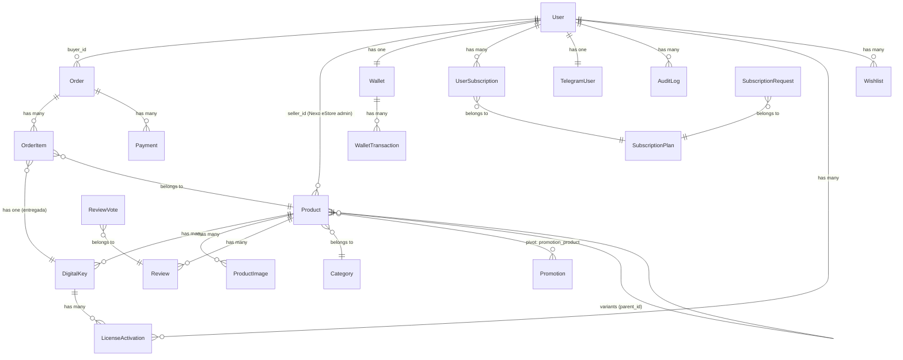

# 🏗️ Arquitectura del Sistema — Nexo Digital Store

> **Stack:** Laravel 13 · Inertia.js · Vue 3 · PrimeVue 4 · SQLite/MySQL · Laravel Sanctum · Spatie Permission
> **Versión revisada:** 2026-04-20 — Modelo Single-Vendor

---

## 🎯 Función Principal del Sistema

**Nexo Digital Store** es una tienda digital de licencias y claves (juegos, software, activaciones) operada por **Nexo eStore** como único vendedor. Su propósito central es:

1. Permitir que los **administradores de Nexo eStore** gestionen el catálogo de productos, claves digitales, entregas y promociones desde el panel administrativo.
2. Permitir que los **compradores (buyers)** adquieran claves usando múltiples métodos de pago.
3. Gestionar un **sistema de economía interna** basado en NexoTokens (NT), que funciona como moneda de puntos/cashback.
4. Garantizar **entrega automática** de claves post-pago y un sistema de **escrow** que protege al comprador.
5. Exponer una **API REST v1** (Laravel Sanctum) para integración con apps móviles (Flutter) y bots externos (Telegram).

> [!NOTE]
> **Modelo Single-Vendor:** No existe un panel de vendedor independiente. Toda la gestión de inventario (productos, claves, pedidos de tienda, ganancias, entregas, promociones) está integrada directamente en el panel administrativo bajo el prefijo `/admin/store/`.

---

## 🧱 Stack Tecnológico

| Capa | Tecnología | Versión |
|---|---|---|
| Backend framework | Laravel | ^13.0 |
| Frontend SPA | Vue 3 + Inertia.js | Vue ^3.5 / Inertia ^3.0 |
| UI Components | PrimeVue 4 (tema Aura) | ^4.5.5 |
| Bundler | Vite | ^7.0 |
| Auth/Roles | Spatie Laravel Permission | ^7.3 |
| OAuth | Laravel Socialite | ^5.26 |
| API Auth | Laravel Sanctum | (nativo Laravel 13) |
| Imágenes | Cloudinary | ^3.1 |
| Cache/Queue | Redis (Predis) | ^3.4 |
| i18n (frontend) | vue-i18n | ^9.14 |
| Animaciones | @vueuse/motion | ^3.0 |
| Charts | Chart.js | ^4.5 |
| Telegram Bot | TelegramService (propio) | — |

---

## 📁 Estructura de Directorios

```
nexokeys/
├── app/
│   ├── Authorization/          # Policies de acceso (Gate)
│   ├── Console/                # Comandos artisan (scheduler)
│   ├── Enums/
│   │   └── Permission.php      # Enum de permisos Spatie
│   ├── Exceptions/             # Excepciones personalizadas (WalletCompromisedException)
│   ├── Http/
│   │   ├── Controllers/
│   │   │   ├── Admin/
│   │   │   │   ├── Store/              # ← Gestión de tienda (single-vendor)
│   │   │   │   │   ├── Products/       # CRUD de productos (7 single-action controllers)
│   │   │   │   │   ├── Orders/         # Pedidos de tienda (Index, Show)
│   │   │   │   │   ├── DashboardController.php
│   │   │   │   │   ├── KeyController.php
│   │   │   │   │   ├── EarningsController.php
│   │   │   │   │   ├── DeliveryController.php
│   │   │   │   │   └── PromotionController.php
│   │   │   │   ├── AuditLogs/
│   │   │   │   ├── Categories/
│   │   │   │   ├── Users/
│   │   │   │   ├── DashboardController.php
│   │   │   │   ├── OrderController.php
│   │   │   │   ├── ProductController.php (moderación)
│   │   │   │   ├── RoleController.php
│   │   │   │   ├── StoreSettingController.php  ← [PUNTO-2] nuevo
│   │   │   │   ├── SubscriptionController.php
│   │   │   │   └── UserController.php
│   │   │   ├── Api/            # API REST v1 (Sanctum — Flutter/Telegram)
│   │   │   ├── Auth/           # Autenticación web (login, OAuth, 2FA)
│   │   │   ├── Payment/        # Gateways: PayPal, MercadoPago
│   │   │   ├── Webhook/        # Callbacks de gateways externos (sin EscrowService)
│   │   │   ├── CartController.php
│   │   │   ├── CheckoutController.php   ← NÚCLEO de compra
│   │   │   ├── LicenseController.php
│   │   │   ├── OrderController.php
│   │   │   ├── ProductController.php
│   │   │   ├── ProfileController.php
│   │   │   ├── ReviewController.php
│   │   │   ├── SubscriptionController.php
│   │   │   ├── WalletTopUpController.php
│   │   │   └── WishlistController.php  ← nuevo
│   │   ├── Middleware/
│   │   │   ├── EnsureUserHasRole.php
│   │   │   ├── EnsureUserIsActive.php
│   │   │   ├── HandleInertiaRequests.php
│   │   │   └── TrustProxies.php
│   │   └── Requests/
│   ├── Jobs/
│   │   ├── RecalculateProductRating.php
│   │   ├── RecordAuditLog.php
│   │   └── SendWelcomeNotification.php
│   ├── Mail/
│   ├── Models/                 # 22 modelos activos
│   │   ├── StoreSetting.php    ← [PUNTO-2] config global Single-Vendor
│   │   ├── Wishlist.php        ← lista de deseos
│   │   ~~SellerProfile.php~~   ← ELIMINADO físicamente [TAREA-3]
│   │   ~~Dispute.php~~         ← ELIMINADO físicamente [TAREA-3]
│   ├── Notifications/
│   │   └── OrderCompletedNotification.php  ← [PUNTO-5] adjunta PDF
│   ├── Providers/
│   ├── Services/
│   │   ├── ReceiptService.php  ← [PUNTO-5] genera PDF dompdf
│   │   ├── WalletService.php   ← fuente de verdad HMAC-SHA256
│   │   ~~EscrowService.php~~   ← ELIMINADO físicamente [TAREA-3]
│   │   └── ...
│   └── Traits/
├── database/
│   ├── migrations/             # 46 migraciones (44 existentes + wishlists + store_settings)
│   └── seeders/
├── resources/
│   └── js/
│       ├── app.js
│       ├── composables/
│       │   ├── usePermissions.js
│       │   └── useTheme.js
│       ├── Layouts/
│       │   ├── AppLayout.vue        # Layout público
│       │   ├── AuthLayout.vue       # Layout de autenticación
│       │   └── DashboardLayout.vue  # Layout admin (único, sin SellerSidebar)
│       ├── Components/
│       │   ├── Admin/
│       │   │   └── AdminSidebar.vue  # Sidebar con sección "Gestión de Tienda"
│       │   └── ui/
│       ├── locales/
│       ├── Pages/
│       │   ├── Admin/
│       │   │   ├── Store/            # ← Páginas de gestión de tienda
│       │   │   │   ├── Products/     # Index, Create, Edit
│       │   │   │   ├── Orders/       # Index, Show
│       │   │   │   ├── Keys/         # Index
│       │   │   │   ├── Deliveries/   # Index
│       │   │   │   ├── Promotions/   # Index, Create, Edit
│       │   │   │   ├── Dashboard.vue
│       │   │   │   └── Earnings.vue
│       │   │   ├── Dashboard.vue
│       │   │   ├── AuditLogs.vue
│       │   │   ├── Categories/
│       │   │   ├── Orders/
│       │   │   ├── Products/
│       │   │   ├── Reviews/
│       │   │   ├── Roles/
│       │   │   ├── Subscriptions/
│       │   │   └── Users/
│       │   ├── Auth/
│       │   ├── Cart/
│       │   ├── Checkout/
│       │   ├── Home/
│       │   ├── Licenses/
│       │   ├── Orders/
│       │   ├── Products/
│       │   ├── Profile/
│       │   ├── Subscriptions/
│       │   ├── Wishlist/
│       │   └── Wallet/
│       │
│       ├── composables/
│       │   └── useOrderChannel.js  ← [PUNTO-4] WebSocket Reverb
│       └── plugins/
└── routes/
    ├── web.php      # Rutas públicas + buyer
    ├── auth.php     # Login, register, OAuth, 2FA, email verify
    ├── admin.php    # Panel admin + gestión de tienda (/admin/store/* + /admin/settings)
    ├── api.php      # API REST v1 (/api/v1/*)
    ├── channels.php # [PUNTO-4] Autorización de canales Reverb
    ├── webhook.php  # Callbacks externos
    ├── seller.php   # DEPRECADO — conservado como documentación
    └── console.php  # Scheduler tasks (Punto 3: claves expiradas + tokens Telegram)
```

---

## 🗄️ Modelos de Base de Datos (22 modelos)

### Diagrama de Relaciones



### Tabla resumen de modelos

| Modelo | Tabla | Función |
|---|---|---|
| `User` | `users` | Usuario central (buyer/admin). ULID, roles Spatie, Socialite, 2FA, Telegram linking. |
| `Product` | `products` | Producto del catálogo. `seller_id` apunta al admin de Nexo eStore. Variantes, preorder, stock, tags. |
| `DigitalKey` | `digital_keys` | Clave/licencia cifrada (AES). Estados: `available` → `reserved` → `sold`. Scope `expiredReservations()` [PUNTO-3] |
| `Order` | `orders` | Pedido de compra. Multi-currency (USD/PEN) + NexoTokens. Dispara broadcast [PUNTO-4] al completarse. |
| `OrderItem` | `order_items` | Línea de pedido. `delivery_status`, `seller_earnings` (= 100% ingreso tienda), `cashback_amount`. |
| `Payment` | `payments` | Registro de pagos externos (PayPal, MercadoPago). |
| `Wallet` | `wallets` | Billetera NT del usuario. Firma HMAC-SHA256. |
| `WalletTransaction` | `wallet_transactions` | Ledger inmutable de movimientos NT. |
| `StoreSetting` | `store_settings` | [PUNTO-2] Config global de la tienda (key-value, caché 1h). Reemplaza SellerProfile. |
| `Category` | `categories` | Categoría jerárquica de productos. |
| `SubscriptionPlan` | `subscription_plans` | Plan de membresía (precio, descuento_percent). |
| `UserSubscription` | `user_subscriptions` | Suscripción activa de un usuario. |
| `SubscriptionRequest` | `subscription_requests` | Solicitud de upgrade (requiere aprobación admin). |
| `Promotion` | `promotions` | Promoción aplicable a productos (porcentaje o fijo). |
| `ProductImage` | `product_images` | Imágenes de productos (`is_cover`, `sort_order`). |
| `Review` | `reviews` | Reseña de producto (aprobación admin, votos). |
| `ReviewVote` | `review_votes` | Votos helpful/not-helpful por usuario. |
| `LicenseActivation` | `license_activations` | Activación de clave en dispositivo (machine_id, OS, IP). |
| `Wishlist` | `wishlists` | Lista de deseos del usuario (user_id + product_id, índice único). |
| `AuditLog` | `audit_logs` | Trazabilidad de acciones críticas. |
| `TelegramUser` | `telegram_users` | Enlace cuenta Nexo ↔ Telegram. Token de vinculación limpiado automáticamente [PUNTO-3]. |
| `Currency` | `currencies` | Monedas soportadas (USD, PEN) con tasa de cambio. |
| ~~`SellerProfile`~~ | ~~`seller_profiles`~~ | **DEPRECADO** [PUNTO-2] — reemplazado por `StoreSetting`. Tabla conservada como histórico. |
| ~~`Dispute`~~ | ~~`disputes`~~ | **DEPRECADO** [PUNTO-1] — modelo Single-Vendor no usa disputas. Tabla conservada como histórico. |

---

## 🚦 Sistema de Rutas

### Mapa de rutas por módulo

| Archivo | Prefix | Middleware | Módulo |
|---|---|---|---|
| `auth.php` | `/` | `guest` / `auth` | Login, Register, OAuth, 2FA, Email Verify |
| `web.php` | `/` | público / `auth` / `verified` | Tienda, Carrito, Checkout, Órdenes, Licencias, Perfil, Wallet |
| `admin.php` | `/admin` | `auth` + `role:admin` | **Administración:** Dashboard, Usuarios, Roles, Categorías, Órdenes, Suscripciones, Auditoría |
| `admin.php` | `/admin/store` | `auth` + `role:admin` | **Gestión de Tienda:** Productos, Claves, Pedidos, Ganancias, Entregas, Promociones |
| `api.php` | `/api/v1` | público / `auth:sanctum` | API REST: Productos, Órdenes, Licencias, Wallet, Notificaciones |
| `webhook.php` | `/webhooks` | sin CSRF | Callbacks: PayPal, MercadoPago, Telegram |

> [!NOTE]
> El archivo `seller.php` se mantiene en el repositorio marcado como DEPRECADO con un comentario explicativo. No registra ninguna ruta activa.

---

## 🏛️ Arquitectura de Controladores

### Patrón Single-Action Controller

Todo el módulo Admin y la Gestión de Tienda usan controladores de una sola acción (`__invoke`):

```
Admin/
├── Store/                        ← Gestión de Tienda (single-vendor)
│   ├── Products/
│   │   ├── IndexController.php       GET  /admin/store/products
│   │   ├── CreateController.php      GET  /admin/store/products/create
│   │   ├── StoreController.php       POST /admin/store/products
│   │   ├── EditController.php        GET  /admin/store/products/{ulid}/edit
│   │   ├── UpdateController.php      PUT  /admin/store/products/{ulid}
│   │   ├── DestroyController.php     DELETE /admin/store/products/{ulid}
│   │   └── ToggleStatusController.php PATCH /admin/store/products/{ulid}/toggle-status
│   ├── Orders/
│   │   ├── IndexController.php       GET  /admin/store/orders
│   │   └── ShowController.php        GET  /admin/store/orders/{ulid}
│   ├── DashboardController.php       GET  /admin/store/dashboard
│   ├── KeyController.php             GET/POST/DELETE /admin/store/keys/*
│   ├── EarningsController.php        GET  /admin/store/earnings
│   ├── DeliveryController.php        GET/POST /admin/store/deliveries/*
│   └── PromotionController.php       CRUD /admin/store/promotions/*
├── Users/
│   ├── IndexController.php
│   ├── ShowController.php
│   ├── UpdateController.php
│   ├── DestroyController.php
│   ├── ToggleStatusController.php
│   └── UpdateRoleController.php
├── Categories/
│   ├── IndexController.php
│   ├── StoreController.php
│   ├── UpdateController.php
│   └── DestroyController.php
└── AuditLogs/
    └── IndexController.php
```

### Controladores de lógica compleja (buyer/public)

| Controlador | Responsabilidad |
|---|---|
| `CheckoutController` | Núcleo del proceso de compra: cálculo de totales, bloqueo de stock, reserva de claves, deducción NT |
| `CartController` | Gestión del carrito (session-based), cálculo de totales con descuentos |
| `Payment/PayPalController` | Crear y capturar órdenes PayPal (REST API v2) |
| `Payment/MercadoPagoController` | Crear preferencia MP, callbacks success/failure/pending |
| `Auth/AuthController` | Login, registro, logout, OAuth (Google, Steam), 2FA |
| `Admin/DashboardController` | KPIs del negocio: ingresos globales, usuarios, órdenes |
| `Admin/Store/DashboardController` | Métricas de la tienda: ganancias, stock, pedidos |

---

## ⚙️ Servicios de Negocio (`app/Services/`)

| Servicio | Responsabilidad |
|---|---|
| **`EscrowService`** | Ciclo de vida de fondos retenidos: `hold()` → `release()` / `refund()`. Auto-release por scheduler. |
| **`WalletService`** | Operaciones de crédito/débito NT con bloqueo pesimista y verificación HMAC. |
| **`LicenseService`** | Forma datos de licencias para el frontend, gestiona activación/desactivación de dispositivos. |
| **`ReviewService`** | Aprobación, rechazo, flagging y cálculo de rating de productos. |
| **`TelegramService`** | Bot Telegram: notificaciones, comandos, entrega de claves, enlace de cuentas. |
| **`CloudinaryService`** | Upload y transformación de imágenes de productos en Cloudinary CDN. |

---

## 🔐 Sistema de Autenticación y Roles

### Flujos de autenticación

```
1. Credenciales (email + password) → bcrypt hash
2. OAuth (Google, Steam) → Laravel Socialite → auto-create user
3. 2FA (Two-Factor Authentication) → TOTP
4. Telegram Linking → deep link token (15 min TTL) → TelegramUser pivot
5. API → Laravel Sanctum (Bearer Token)
```

### Roles del sistema (Spatie Permission)

| Rol | Acceso |
|---|---|
| `buyer` | Tienda pública, carrito, checkout, órdenes, licencias, wallet, perfil |
| `admin` | Todo lo de buyer + panel `/admin/*` (gestión global) + `/admin/store/*` (inventario Nexo eStore) |

> [!NOTE]
> **El rol `seller` ha sido eliminado del flujo activo.** Nexo eStore opera con un único propietario administrador. No existe registro de usuarios como vendedores externos.

### Middleware de protección

| Middleware | Acción |
|---|---|
| `EnsureUserHasRole` | Verifica rol con Spatie |
| `EnsureUserIsActive` | Bloquea usuarios con `is_active = false` |
| `HandleInertiaRequests` | Inyecta en el frontend: user, permisos, wallet, suscripción activa, locale, tema |

---

## 💳 Flujo de Pago (Checkout)

```mermaid
flowchart TD
    A[Usuario en Carrito] --> B[GET /checkout]
    B --> C{Método de pago}
    C -->|NexoTokens NT| D[POST /checkout → CheckoutController::process]
    C -->|PayPal| E[POST /payment/paypal/create-order]
    C -->|MercadoPago| F[POST /payment/mp/preference]

    D --> G[DB::transaction\n→ reserva claves\n→ debita NT\n→ orden status=completed]
    G --> H[Entrega automática de claves]
    H --> I[Cashback NT acreditado]

    E --> J[PayPal JS SDK\n→ captureOrder]
    J --> K[POST /payment/paypal/capture-order]
    K --> L[Webhook completeOrder\n→ marca sold\n→ entrega claves]

    F --> M[MercadoPago JS SDK\n→ redirect]
    M --> N[GET /payment/mp/success\no Webhook IPN]
    N --> L

    L --> O["broadcast(OrderCompleted)\n[PUNTO-4] Reverb notifica al buyer"]
    O --> P[Vue 3 Echo.private\nreload({ only: ['order'] })]
```

---

## 🪙 Sistema NexoTokens (NT)

| Operación | Dirección | Cuándo |
|---|---|---|
| **Compra con NT** | Débito | Al hacer checkout con NexoTokens |
| **Cashback NT** | Crédito | Al completarse un pedido (otorgado por WalletService) |
| **Recarga de wallet** | Crédito | Al comprar NT con PayPal/MercadoPago |
| **Reembolso** | Crédito | Admin procesa manualmente (no requiere flujo de disputas en Single-Vendor) |

**Seguridad:** HMAC-SHA256 en cada `Wallet` + `lockForUpdate()` en toda operación financiera.

> [!IMPORTANT]
> **[REF-2] WalletService como fuente de verdad única.** Todas las operaciones de crédito/débito pasan por `WalletService::credit()` y `WalletService::debit()`. Esto garantiza que el HMAC-SHA256 se calcule consistentemente en `CheckoutController`, `TelegramWebhookController`, `MercadoPagoWebhookController` y `PayPalWebhookController`. Antes, cada controlador implementaba su propia versión manual, creando inconsistencias.

> [!NOTE]
> **[REF-1] Modelo Single-Vendor — Sin comisiones externas.** `commission_rate = 0` y `commission_amount = 0` en todos los `OrderItem`. El campo `seller_earnings` almacena el `unit_price` completo, representando el 100% como ingreso de Nexo eStore. El `EscrowService` fue eliminado (no tiene sentido retener fondos para uno mismo).

---

## 🖥️ Frontend (Vue 3 + Inertia.js)

### Estructura de páginas

| Módulo | Vistas principales |
|---|---|
| `Auth/` | Login, Register, ForgotPassword, ResetPassword, VerifyEmail |
| `Home/` | Landing page del marketplace |
| `Products/` | Catálogo, detalle de producto |
| `Cart/` | Vista del carrito |
| `Checkout/` | Proceso de pago (multi-gateway) |
| `Orders/` | Lista de órdenes del buyer, detalle con indicador WebSocket [PUNTO-4] |
| `Licenses/` | Licencias compradas, activaciones por dispositivo |
| `Wallet/` | Balance NT, historial, recarga |
| `Wishlist/` | Lista de deseos |
| `Subscriptions/` | Planes disponibles, subscripción activa |
| `Profile/` | Datos personales, seguridad, vinculación Telegram |
| `Admin/` | Dashboard KPIs, Usuarios, Roles, Categorías, Órdenes, Suscripciones, Reviews, AuditLogs |
| `Admin/Store/` | Panel Tienda, Productos CRUD, Claves, Pedidos Tienda, Ganancias, Entregas, Promociones |
| `Admin/StoreSettings` | [PUNTO-2] Configuración global de la tienda |

### Layouts

| Layout | Uso |
|---|---|
| `AppLayout.vue` | Tienda pública — navbar, carrito, toggle de tema |
| `AuthLayout.vue` | Páginas de autenticación |
| `DashboardLayout.vue` | Panel admin — usa **siempre `AdminSidebar`** (sin lógica de SellerSidebar) |

### AdminSidebar — Secciones

| Sección | Color | Rutas |
|---|---|---|
| **Administración** | Primary (indigo) | Dashboard, Usuarios, Roles, Órdenes, Productos (moderación), Categorías, Suscripciones, Reseñas, Auditoría |
| **Gestión de Tienda** | Cyan (`#06b6d4`) | Panel Tienda, Productos, Claves, Pedidos Tienda, Promociones, Ganancias, Entregas |

---

## 🔔 Jobs y Notificaciones

| Job | Función |
|---|---|
| `RecalculateProductRating` | Recalcula `rating` y `rating_count` del producto |
| `RecordAuditLog` | Inserta registro en `audit_logs` async |
| `SendWelcomeNotification` | Email de bienvenida tras registro |

| Notificación | Canal |
|---|---|
| `OrderCompletedNotification` | Email + Database |
| `WelcomeNotification` | Email |
| `EmailVerificationNotification` | Email |

---

## 📡 API REST v1 (Sanctum)

**Base URL:** `/api/v1/`

| Grupo | Endpoints | Auth |
|---|---|---|
| **Público** | `GET /products`, `GET /products/{ulid}`, `GET /categories`, `GET /currencies` | No |
| **Auth** | `POST /auth/login`, `POST /auth/register`, `POST /auth/2fa/verify` | No |
| **Órdenes** | `GET /orders`, `GET /orders/{ulid}`, `POST /orders` | Sanctum |
| **Licencias** | `GET/POST /licenses/{ulid}/activate`, `/deactivate`, `/heartbeat` | Sanctum |
| **Wallet** | `GET /wallet`, `GET /wallet/transactions` | Sanctum |
| **Suscripciones** | `GET /subscriptions/plans`, `GET /subscriptions/current` | Sanctum |
| **Perfil** | `PUT /profile`, `PUT /profile/password` | Sanctum |
| **Notificaciones** | `GET /notifications`, `POST /notifications/{id}/read` | Sanctum |
| **Wishlist** | `GET /wishlist`, `POST /wishlist/toggle`, `DELETE /wishlist` | Sanctum |

---

## 🤖 Integración Telegram

- **Bot** gestiona: comandos `/start`, `/balance`, `/orders`, entrega de claves por mensaje privado.
- **Webhook** en `/webhooks/telegram` sin CSRF.
- **Deep Link** de vinculación: token en perfil → `t.me/bot?start=TOKEN` → enlace automático.

---

## 🔒 Seguridad Implementada

| Medida | Implementación |
|---|---|
| **Hashing de contraseñas** | bcrypt (Laravel cast `'hashed'`) |
| **Cifrado de claves digitales** | AES-256 vía `encrypt()` / `decrypt()` |
| **Integridad de billetera** | HMAC-SHA256 (`assertNotCompromised()`) centralizado en `WalletService` [REF-2] |
| **Race conditions** | `lockForUpdate()` en wallet y stock; fix N+1 con bulk lock [REF-3] |
| **Anti-fraude en checkout** | Máx. 3 pedidos pending + máx. 3 failed/hora |
| **Rate limiting** | `throttle:10,1` checkout, `throttle:5,1` gateways |
| **2FA** | TOTP (Two-Factor Authentication) |
| **OAuth** | Laravel Socialite (Google, Steam) |
| **Email verification** | `MustVerifyEmail` + links firmados |
| **Roles y permisos** | Spatie Permission (DB-driven) |
| **CSRF** | Protección Laravel (excepto rutas webhook) |
| **Audit logs** | Trazabilidad vía `AuditLog` model + Job |
| **Webhook MercadoPago** | `x-signature` HMAC-SHA256: `id:{data.id};request-id:{x-request-id};ts:{ts};` [REF-5] |
| **Webhook PayPal** | Verificación via API `/v1/notifications/verify-webhook-signature` (OAuth2) [REF-5] |
| **Webhook Telegram** | `X-Telegram-Bot-Api-Secret-Token` header con `hash_equals()` [REF-5] |

> [!WARNING]
> **[REF-5] Webhooks Anti-Spoofing:** Las rutas `/webhooks/*` están excluidas del middleware CSRF. La protección reside **exclusivamente** en la validación de firma del proveedor. En entorno `dev`, si `webhook_secret` / `webhook_id` están vacíos, la validación es omitida (`return true`). **Nunca dejar en blanco en producción.**

---

## 🚀 Comandos de desarrollo

```bash
# Iniciar entorno completo (server + queue + logs + vite)
composer dev

# Setup inicial
composer setup

# Tests
composer test
```

---

## ⚡ Optimizaciones de Rendimiento

| Área | Optimización |
|---|---|
| **Checkout N+1 locks** [REF-3] | `Product::whereIn()->lockForUpdate()->get()->keyBy('id')` — 1 sola query para todos los productos del carrito |
| **wishlistCount** | Lazy-evaluated en Inertia `share()` — solo cuenta si hay usuario autenticado |
| **StoreSetting cache** [PUNTO-2] | Todos los settings de tienda se leen desde `Cache::remember()` con TTL de 1h. Se invalidan automáticamente en cada `save()/delete()` del modelo |
| **Shared props** | `fn ()` lazy closures en `HandleInertiaRequests` para evitar queries en rutas que no las necesitan |
| **Fulltext search** | Scope `search()` en `Product` con índice FULLTEXT en MySQL |
| **Queue** | Jobs async (`RecordAuditLog`, `SendWelcomeNotification`) para no bloquear el request cycle |
| **Pessimistic locking** | `lockForUpdate()` en todas las escrituras financieras para prevenir race conditions |

---

## 🔄 Historial de Refactorizaciones Mayores

| Fecha | Refactorización | Archivos afectados |
|---|---|---|
| 2026-04-20 | Migración de Multi-Vendor a Single-Vendor (Nexo eStore) | `routes/`, `Controllers/Admin/Store/`, `Pages/Admin/Store/` |
| 2026-04-20 | [REF-1] Eliminación de comisiones multi-vendor (`commissionRate/Amount/sellerEarnings`) | `CheckoutController`, `TelegramWebhookController` |
| 2026-04-20 | [REF-2] Centralización de wallet ops en `WalletService` | `CheckoutController`, 3 webhooks controllers |
| 2026-04-20 | [REF-3] Fix N+1 lock en checkout — `whereIn+lockForUpdate+keyBy` | `CheckoutController::createOrder()` |
| 2026-04-20 | [REF-4] UI Earnings: "Comisión" → "Cashback Otorgado", terminología de tienda propia | `Admin/Store/Earnings.vue`, `EarningsController` |
| 2026-04-20 | [REF-5] Auditoría y documentación de seguridad anti-spoofing en webhooks | `MercadoPagoWebhookController`, `PayPalWebhookController`, `TelegramWebhookController` |
| 2026-04-20 | Implementación sistema Wishlist (tabla, modelo, controladores, rutas, UI) | `wishlists`, `Wishlist.php`, `WishlistController`, `Wishlist/Index.vue` |
| 2026-04-20 | **[PUNTO-1]** Eliminación de `EscrowService` y flujo de disputas. Pagos completan directamente | `EscrowService.php` (eliminado), `DeliveryController` x2, `Order.php`, `EscrowAutoRelease` (no-op), `console.php` |
| 2026-04-20 | **[PUNTO-2]** Migración de `SellerProfile` a `StoreSetting` (singleton key-value global) | `StoreSetting.php` (nuevo), `StoreSettingController.php` (nuevo), `User.php`, `EarningsController`, `HandleInertiaRequests`, `admin.php`, migración `store_settings` |
| 2026-04-20 | **[PUNTO-3]** Tareas scheduler: liberar `DigitalKey` expiradas + limpiar `link_token` Telegram | `routes/console.php` — 2 nuevos `Schedule::call()` |
| 2026-04-20 | **[PUNTO-4]** WebSockets Laravel Reverb: evento `OrderCompleted` broadcast en webhooks MP/PayPal | `app/Events/OrderCompleted.php` (nuevo), `routes/channels.php` (nuevo), `composables/useOrderChannel.js` (nuevo), `bootstrap/echo.js` (nuevo) |
| 2026-04-20 | **[PUNTO-5]** Recibos PDF en `OrderCompletedNotification` via `ReceiptService` + dompdf | `ReceiptService.php` (nuevo), `views/pdf/receipt.blade.php` (nuevo), `OrderCompletedNotification.php` actualizado |
| 2026-04-20 | **[TAREA-1]** WebSocket integrado en `Orders/Show.vue`: banner animado, toast y `router.reload({ only: ['order','items'] })` | `Pages/Orders/Show.vue` — `onMounted` + `onUnmounted` + `Echo.private().listen()` |
| 2026-04-20 | **[TAREA-2]** Receipt Blade reescrito con tablas HTML puras (100% compatible dompdf, sin flexbox/grid) | `views/pdf/receipt.blade.php` — tabla de items, totales, aviso seguridad, footer |
| 2026-04-20 | **[TAREA-3]** Limpieza física confirmada: 3 archivos obsoletos eliminados del disco | `EscrowService.php`, `SellerProfile.php`, `Dispute.php` — verificado con `Test-Path` → `False` |
| 2026-04-20 | **[TAREA-4]** `EarningsController` refactorizado Single-Vendor: `total_revenue`, `total_cashback_granted`, `total_sales_count`, gráfico diario, `Cache::remember` 30 min con clave por rango de fechas | `Admin/Store/EarningsController.php` — sin referencias a comisiones ni SellerProfile |

---

> [!IMPORTANT]
> **Comandos de instalación requeridos:**
> ```bash
> # Base de datos — crea store_settings (con semilla) y wishlists
> php artisan migrate
>
> # [PUNTO-4] WebSockets — Laravel Reverb
> php artisan install:broadcasting   # Crea config/reverb.php
> npm install laravel-echo pusher-js
>
> # [PUNTO-5] PDF Receipts — dompdf
> composer require barryvdh/laravel-dompdf
>
> # Iniciar Reverb en desarrollo
> php artisan reverb:start
> ```

> [!NOTE]
> **Acceso a settings de tienda desde Vue:**
> Los settings públicos (is_public=true) se comparten via Inertia: `$page.props.store.store_name`, `$page.props.store.nt_rate_to_usd`, etc.

> [!TIP]
> **Invalidar caché de earnings manualmente:**
> ```bash
> php artisan cache:forget earnings:kpi:YYYYMMDD:YYYYMMDD
> # o limpiar todo el caché:
> php artisan cache:clear
> ```

---

*Documento actualizado el 2026-04-20 — Refactorizaciones REF-1 a REF-5 + Puntos 1 al 5 + Tareas 1 al 4 completadas.*
